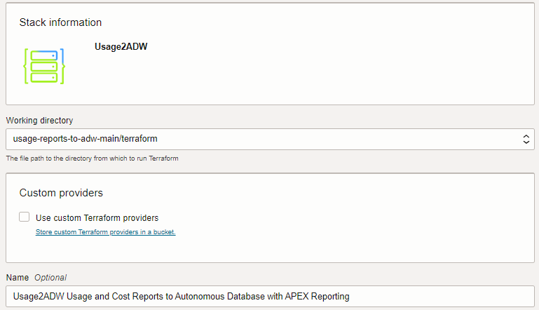
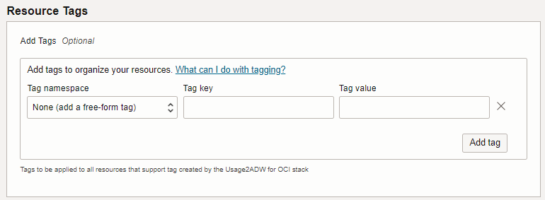
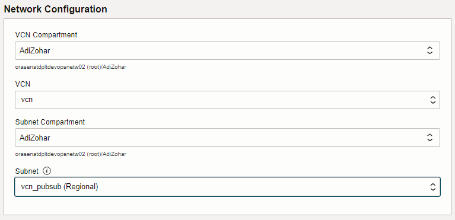
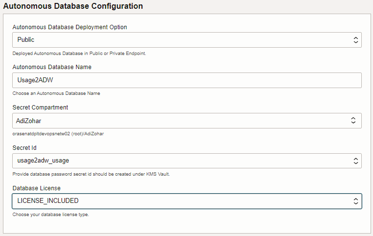
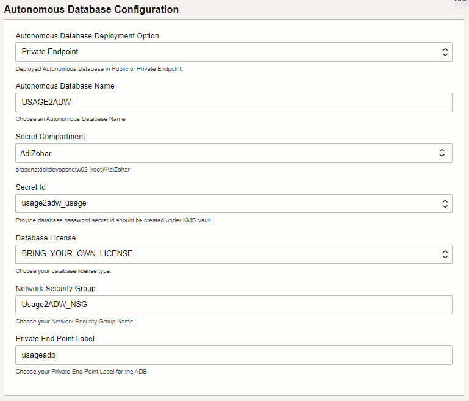
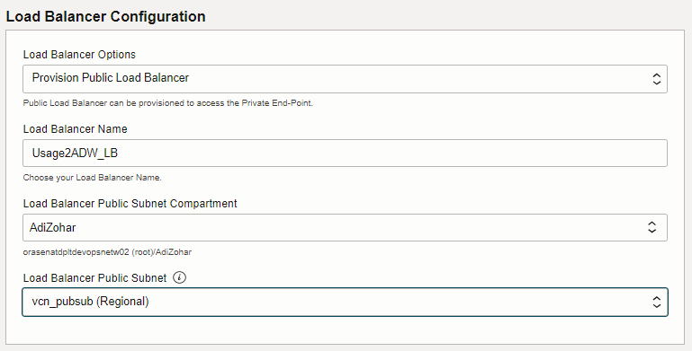
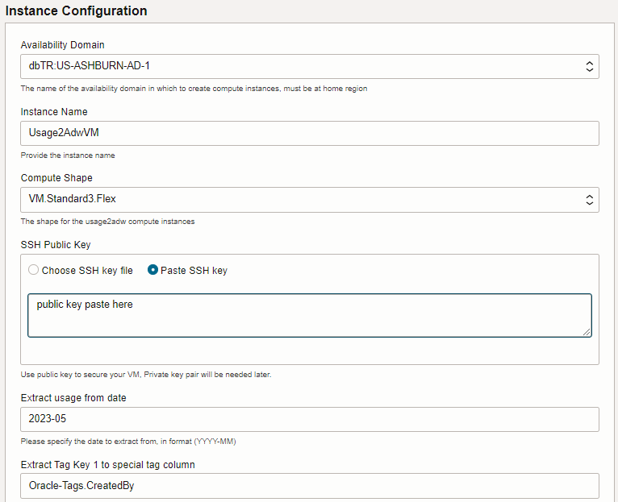

# Usage2ADW - Oracle Cloud Infrastructure Usage and Cost Reports to Autonomous Database with APEX Reporting

## Step by Step installation using Oracle Cloud Resource Management and Terraform
usage2adw is a tool which uses the Python SDK to extract the usage reports from your tenant and load it to Oracle Autonomous Database.

Oracle Application Express (APEX) will be used for reporting. 

**Developed by Adi Zohar**

## Must be deployed at Home Region and VCN must have access to the internet using Internet Gateway or NAT Gateway and utilize Vault Secret for database password.

**DISCLAIMER - This is not an official Oracle application,  It does not supported by Oracle Support, It should NOT be used for utilization calculation purposes, and rather OCI's official 
[cost analysis](https://docs.oracle.com/en-us/iaas/Content/Billing/Concepts/costanalysisoverview.htm) 
and [usage reports](https://docs.oracle.com/en-us/iaas/Content/Billing/Concepts/usagereportsoverview.htm) features should be used instead.**


## 1. Create KMS Vault Secret for Autonomous database password

OCI -> Menu -> Identity & Security -> Vault

Choose Vault or create new Vault, Please follow [Vault Documentation](https://docs.oracle.com/en-us/iaas/Content/KeyManagement/home.htm)

Make sure you have an existing Master Encryption Key, [Master Key Documentation](https://docs.oracle.com/en-us/iaas/Content/KeyManagement/Tasks/managingkeys_topic-To_create_a_new_key.htm#createnewkey)

Create Secret for the Autonomous Database Password, [Secret Documentation](https://docs.oracle.com/en-us/iaas/Content/KeyManagement/Tasks/managingsecrets_topic-To_create_a_new_secret.htm#createnewsecret)

The password must meet the strong password complexity criteria based on Oracle Cloud security standards, [doc](https://docs.oracle.com/en/cloud/paas/autonomous-database/serverless/adbsb/manage-users-create.html#GUID-72DFAF2A-C4C3-4FAC-A75B-846CC6EDBA3F)

**Please ensure that your password meets the following criteria:**

- Length: Between 12 and 30 characters.
- The password cannot contain the username.
- Character types: Must include at least one uppercase letter, one lowercase letter, and one numeric character (e.g. 0-9).
- No dictionary words: Avoid using common words found in the dictionary.
- Symbols: If you wish to use symbols, you may only use the "#" symbol.
  

## 2. Generate Terraform stack from Usage Reports to ADW Github


Navigate to Usage Reports to ADW GitHub - [https://github.com/oracle-samples/usage-reports-to-adw](https://github.com/oracle-samples/usage-reports-to-adw)


```
--> Choose Code drop down
--> Download Zip
```

## 3. Launch Oracle Resource Management Stack

```

OCI -> Menu -> Developer Services -> Resource Management -> Stacks

--> Create Stack
--> My Configuration
--> Choose Zip File
--> Browse to the Zip file downloaded from GitHub.

--> Name = Usage2ADW Usage and Cost Reports to Autonomous Database with APEX Reporting
--> Press Next 

```





### 3a. Compartment

```

Stack Compartment - Specifies the Compartment where the resources will be created
It is generally the location that you have access to build the compute node and autonomous database.

```


### 3b. Resource Tags 

Option to tag the resources





### 3c. Identity Configuration

```

   - New IAM Dynamic Group and Policy will be created - 
     New Dynamic Group and Policy will be created - This option required Admin access
   - I have already created Dynamic Group and Policy per the documentation - 
     Choose this option if you already created Dynamic group and policies according to the documentation.
     Below is the requirement:
   - APPCOMP is the compartment where the usage2adw will be installed
     
     Dynamic Group:
         OCI -> Menu -> Identity -> Default Domain -> Dynamic Groups -> Create Dynamic Group
         --> Name = UsageDownloadGroup 
         --> Desc = Dynamic Group for the Usage Report Compartment
         --> Rule 1 = ANY { instance.compartment.id = 'OCID_Of_Compartment' }

     Policy:
         OCI -> Menu -> Identity -> Policies
         Choose Root Compartment
         Create Policy
         --> Name = UsageDownloadPolicy
         --> Desc = Allow Dynamic Group UsageDownloadGroup to Extract Usage report script
         Statements:
         define tenancy usage-report as ocid1.tenancy.oc1..aaaaaaaaned4fkpkisbwjlr56u7cj63lf3wffbilvqknstgtvzub7vhqkggq
         endorse dynamic-group UsageDownloadGroup to read objects in tenancy usage-report
         Allow dynamic-group UsageDownloadGroup to inspect compartments in tenancy
         Allow dynamic-group UsageDownloadGroup to inspect tenancies in tenancy
         Allow dynamic-group UsageDownloadGroup to read autonomous-database in compartment {APPCOMP}
	 Allow dynamic-group UsageDownloadGroup to read secret-bundles in compartment {APPCOMP}
         *** Please don't change the usage report tenant OCID, it is fixed.
     
```


### 3d. Network Configuration - 

```
   - Select the VCN compartment and the VCN
   - Select the Subnet compartment and the Subnet

```




### 3e. Autonomous Database Configuration

```

   - Autonomous Database Deployment Option - Public or Private Endpoint
   - Autonomous database name - the name to be assigned to the Autonomous database
   - Database Secret - Choose the Secret Compartment and Secret you created
   - Database License - License Included or Bring your own license if you have
   - Network Security Group - For Privatendpoint - choose network security group name
   - Private End Point Label - the host name for the private end point

```





### 3f. Load Balancer Configuration - If private end point created

```

   - Load Balancer Options - Provision or Not
   - Load Balancer Name
   - Load Balancer Public Subnet Compartment
   - Load Balancer Public Subnet

```



### 3g. Instance Configuration

```
   - Availability Domain to deploy the instance
   - Instance Name - the name of the compute instance 
   - Compute Shape - Compute Shape to deploy the instance
   - SSH Public Key - The public key you generated at the prerequisite stage
   - Extract Usage From Date - Load Data since which date with format of YYYY-MM (i.e. 2020-08)
   - Extract Tag Key 1 to special tag column 1 - use this tag to load to special column 1 for better filter and report
   - Extract Tag Key 2 to special tag column 2 - use this tag to load to special column 2 for better filter and report

```




### 3h. Oracle Analytics (OAC)


Option to deploy Oracle Analytics Cloud (OAC)

Advance Feature

It will deploy only, connection to ADW database should be done manually using the documentation


### 3i. Applying the Stack


```

Click Next.

On the Review page, review the information you provided and then click Create.

Press Apply.

When you get a message Provisioning Completed/Successful from the OCI console, the instance is created. 
However please note the rest of the Usage2ADW configuration happens in the background 
including extract of the usage which takes approximately 10 minutes to complete. 

After approximately 10 minutes log into the compute node and examine the setup.log file

```

## 4. Login to Apex Application


```
Check the Resource Manager Log and find APEX_Application_Login_URL 
Should be similar to: https://xxxxxx.adb.us-ashburn-1.oraclecloudapps.com/ords/f?p=100:LOGIN_DESKTOP::::::
Bookmark this page for future use

First time may take up to a minute to load

User = Usage
Password = Password you defined for the application

```


## 5. Open Autonomous Database APEX Workspace Admin if required

```
OCI Console -> Autonomous Databases -> ADWCUSG -> Service Console
Development Menu -> Oracle APEX
Choose Workspace Login.

Workspace = Usage
User = Usage
Password = Password you defined for the application


```


## Additional Contents
Please Visit [How To File](step_by_step_howto.md)


## License

Copyright (c) 2025, Oracle and/or its affiliates.
Licensed under the Universal Permissive License v 1.0 as shown at  https://oss.oracle.com/licenses/upl/ 